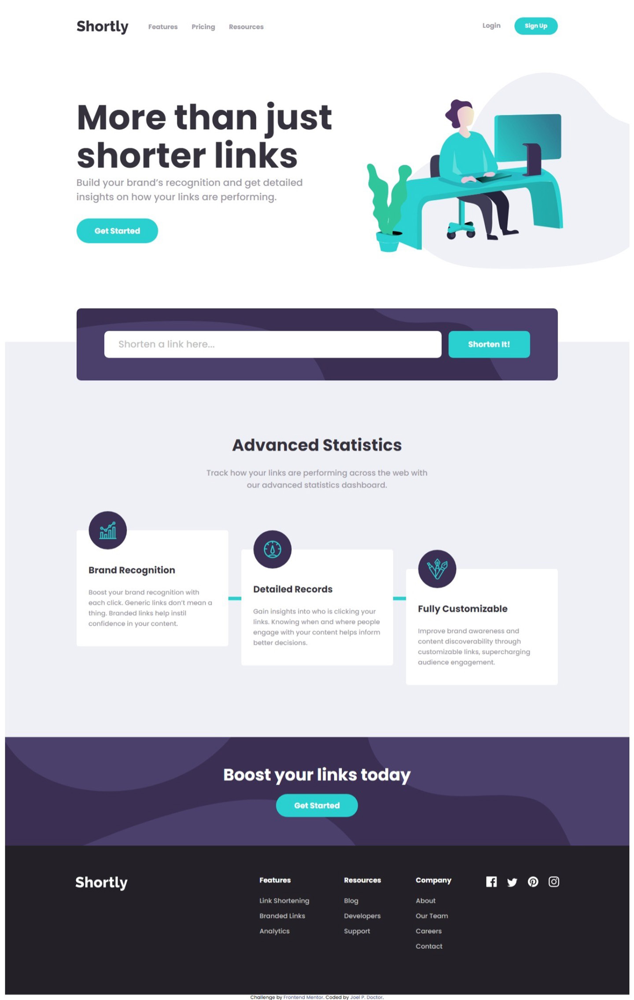

# Shortly URL Shortening

## Frontend Mentor - Shortly URL shortening API Challenge solution

This is a solution to the [Shortly URL shortening API Challenge challenge on Frontend Mentor](https://www.frontendmentor.io/challenges/url-shortening-api-landing-page-2ce3ob-G). Frontend Mentor challenges help you improve your coding skills by building realistic projects.

## Table of contents

- [Overview](#overview)
  - [The challenge](#the-challenge)
  - [Screenshot](#screenshot)
  - [Links](#links)
- [My process](#my-process)
  - [Built with](#built-with)
  - [What I learned](#what-i-learned)
  - [Continued development](#continued-development)
  - [Useful resources](#useful-resources)
- [Author](#author)
- [Acknowledgments](#acknowledgments)

## Overview

### The challenge

Users should be able to:

- View the optimal layout for the site depending on their device's screen size
- Shorten any valid URL
- See a list of their shortened links, even after refreshing the browser
- Copy the shortened link to their clipboard in a single click
- Receive an error message when the `form` is submitted if:
  - The `input` field is empty

Additional things that I did:

- Implemented a check that will stop an invalid URL from being sent to the API.
- The error display will show the API error message in case a URL is rejected. (this usually contains the reason the URL is rejected)

### Screenshot



### Links

- Solution URL: https://www.frontendmentor.io/solutions/responsive-url-shortening-site-using-react-scss-api-4Di8Dh_Xz
- Live Site URL: http://kingwell47.github.io/url-shortnening

## My process

### Built with

- Semantic HTML5 markup
- CSS custom properties
- SCSS
- Flexbox
- Mobile-first workflow
- [React](https://reactjs.org/) - JS library

### What I learned

Picked this one as API practice and it was really fun overall!

```js
async function getShortenenedUrl(originalUrl) {
  const response = await fetch(
    "https://api.shrtco.de/v2/shorten?url=" + originalUrl
  );
  const { ok, error, result } = await response.json();
  if (ok) {
    return handleSuccess({
      originalUrl: "https://" + originalUrl,
      shortUrl: result.full_short_link2,
    });
  } else {
    return handleError(error);
  }
}
```

Using "clamp" for font-sizing makes responsive text way easier:

```scss
&__title {
  font-size: clamp(fnc.rem(40), 6vw, fnc.rem(80));
  color: var(--color-neutral-300);
}
```

Handling errors is one of the things I really wanted to learn about:

```js
const handleError = (errMessage) => {
  setError(true);
  setProcessing(false);
  if (errMessage === undefined) return setErrorMessage("Please add a link");
  setErrorMessage(errMessage);
};
```

### Continued development

Adding an animation for the "Shorten it!" button seems like a good place to improve this design.

A way to delete previously shortenend URLs or clear the local storage also could be implemented.

### Useful resources

- [min(), max(), and clamp() are CSS magic! by Kevin Powell](https://www.youtube.com/watch?v=U9VF-4euyRo) - Using these functions made the design the most responsive one I've coded yet.
- [Easier Error Handling Using async await in JavaScript by Jesse Warden](https://www.youtube.com/watch?v=0iiZHlT0boc) - This video helped me figure out how to handle the API responses and set-up error handling.
- [Using Async/Await with the Fetch API - JavaScript Tutorial by Dcode](https://www.youtube.com/watch?v=Yp9KIcSKTNo) - Good instructions on how to set-up the Fetch function for this API.
- [useLocalStorage from useHooks.com](https://usehooks.com/useLocalStorage/) - Used to set up storing past shortened links.

## Author

- Website - [Joel P. Doctor](https://joeldoctor.com/)
- Frontend Mentor - [@kingwell47](https://www.frontendmentor.io/profile/kingwell47)
- Twitter - [@kingwell47](https://www.twitter.com/kingwell47)
- LinkedIn - [Joel P. Doctor](https://www.linkedin.com/in/joel-d-05854919/)

## Acknowledgments

Thanks to Ms. Jessica Chan (Coder Coder) and all the other YouTube creators making their knowledge available!
